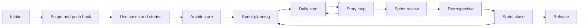

<div align="center">


[](https://github.com/SuhaasNv/whole-team/actions/workflows/validate.yml)
[](LICENSE)


```
/plugin marketplace add SuhaasNv/whole-team
/plugin install whole-team@whole-team
```

</div>

---

AI agents write code fast. What they skip is everything a good team does around the code: agreeing the scope before building, saying "that will not fit in three days", refusing to put Kubernetes under a two-user app, writing the test before calling it done, keeping the board honest, holding a retro, and asking before pushing.

**whole-team** puts that team into your agent. You stay the product owner and make the calls; the agent plays scrum master, architect, developer, QA, security, DevOps, technical writer and reviewer, and it holds the gates.

## Contents

- [Who it is for](#who-it-is-for)
- [Install](#install)
- [Your first ten minutes](#your-first-ten-minutes)
- [Slash commands](#slash-commands)
- [How it works](#how-it-works)
- [Boards: Notion, Jira, Linear, GitHub Projects or none](#boards-notion-jira-linear-github-projects-or-none)
- [Scoping and pushback, in practice](#scoping-and-pushback-in-practice)
- [What lands in your repo](#what-lands-in-your-repo)
- [Permissions and safety](#permissions-and-safety)
- [Tested behaviour](#tested-behaviour)
- [Troubleshooting](#troubleshooting)
- [FAQ](#faq)
- [How it compares](#how-it-compares)
- [Where it comes from](#where-it-comes-from)

## Who it is for

- **Solo developers and indie hackers** who want their agent to ship like a disciplined team, not a code generator.
- **Candidates doing take-home assessments**, where the scope decision, tests and docs are graded as much as the features.
- **Freelancers and consultants** handing a codebase to a client who will read the docs.
- **Small teams** who want one shared, lightweight way of working with their agents.

Not for you if you want an agent that builds whatever you type without asking questions.

## Install

### Claude Code: plugin (recommended)

Inside Claude Code:

```
/plugin marketplace add SuhaasNv/whole-team
/plugin install whole-team@whole-team
```

You get the skill, 14 slash commands and an independent reviewer agent. Check it worked with `/whole-team:help`.

### Any agent: Codex, Cursor, GitHub Copilot, Gemini CLI, Claude Code and 70+ others

With the open [skills CLI](https://github.com/vercel-labs/skills), from your project folder:

```bash
npx skills add SuhaasNv/whole-team
```

Add `-g` to install for all your projects. This installs the skill only (slash commands and the reviewer agent are Claude Code plugin features); you drive it in plain words, for example "use whole-team to scope this brief".

### Manual

```bash
git clone https://github.com/SuhaasNv/whole-team.git
cp -r whole-team/plugins/whole-team/skills/whole-team ~/.claude/skills/     # every project
# or: cp -r whole-team/plugins/whole-team/skills/whole-team .claude/skills/ # this project only
```

For other agents, copy the same folder into their skills directory.

### Requirements

| Needs | Why |
|-------|-----|
| `git` | Branches, commits, merges |
| Python 3.9+ (preinstalled on macOS and most Linux) | The helper script `wt.py`; standard library only, nothing to `pip install`. Without Python the agent does the same steps by hand |
| `gh` CLI (optional) | GitHub Projects boards |

### Update and uninstall

| | Claude Code plugin | skills CLI |
|--|--------------------|-----------|
| Update | `claude plugin marketplace update whole-team` then `claude plugin update whole-team@whole-team` (or the `/plugin` menu), and restart | `npx skills update whole-team` |
| Uninstall | `claude plugin uninstall whole-team@whole-team` (or the `/plugin` menu) | `npx skills remove whole-team` |

Uninstalling leaves your project's documents in place; they are yours.

## Your first ten minutes

```
/whole-team:start
```

1. The agent reads your repo first, then asks **one batch** of questions: what you are building, the ceremony profile, **where stories and use cases should live (GitHub Projects, Linear, Jira, Notion or a local board)**, sprint length and branching.
2. It creates `.whole-team.json` and the documents for your profile, adds a working agreement to `CLAUDE.md` or `AGENTS.md`, and helps you connect the board.
3. Got a brief? `/whole-team:scope` and paste it. You get a capacity table, a recommended slice, and a decision to make.
4. `/whole-team:plan` writes requirements, use cases and user stories. `/whole-team:sprint` plans the first sprint and waits for your yes.
5. `/whole-team:story` builds the first story end to end and reports back in one line:

```
Done: US-000 walking skeleton (tests 6 passed, build ok). Next: US-010 create account. Decide: none.
```

## Slash commands

| Command | Use it when |
|---------|-------------|
| `/whole-team:start` | First time in a project, new or existing |
| `/whole-team:scope` | You have a brief, assessment, spec or big request |
| `/whole-team:plan` | Scope is agreed; write requirements, use cases and stories |
| `/whole-team:board` | Choose, connect or re-sync Notion, Jira, Linear, GitHub Projects or a local board |
| `/whole-team:sprint` | Plan the next sprint: goal, ready stories, capacity, your yes |
| `/whole-team:status` | Daily start: where the sprint stands and what is next |
| `/whole-team:story` | Build the next story (or `US-012`) end to end |
| `/whole-team:bug` | Something is broken: failing test first, smallest fix |
| `/whole-team:code-review` | Independent review of the current branch |
| `/whole-team:handover` | You are stopping for the day |
| `/whole-team:retro` | A retrospective on its own |
| `/whole-team:close-sprint` | End of sprint: review, retro, close |
| `/whole-team:release` | Ship a version or hand in an assessment |
| `/whole-team:help` | The cheat sheet and the best next command |

## How it works

### The rules

1. **Scope before code; no story, no code.** Nothing is built that is not in `SCOPE.md` and in a story with acceptance criteria.
2. **Do not overengineer, and change only what the story needs.** Every new service, layer or dependency names the requirement that needs it. No drive-by restyling, rewording or reformatting.
3. **Push back with evidence.** Once, with numbers, an alternative and the decision needed. Then your call is recorded and followed.
4. **The sprint is a commitment.** New work mid-sprint swaps something out or waits, with your yes.
5. **Every hat, every story.** Done means tests, docs, board and an independent review.
6. **Gates are real.** You approve scope, the sprint plan, designs, and every push, pull request, tag and deploy.
7. **Report the truth.** Nothing marked Done that fails its Definition of Done; no "tests pass" without a run.

### The lifecycle



| Ceremony | What happens |
|----------|--------------|
| Sprint planning | Last retro's actions checked; a one-sentence goal; only *ready* stories pulled, within 70% of capacity; cut order agreed; your yes |
| Daily start | `wt.py status`, open handover resumed, one line to you |
| Refinement | Stories split and made testable until they meet the Definition of Ready |
| Sprint review | The goal demonstrated end to end; you accept or reject each story |
| Retrospective | Went well, slowed us, and one to three concrete actions with owners, tracked until done |
| Sprint close | Tests green, board in sync, CHANGELOG with Shipped / Slipped, scope re-checked |

### Ceremony profiles

| Profile | For | Documents |
|---------|-----|-----------|
| `lite` | Weekend builds, prototypes | Scope, changelog, architecture one-pager, stories, Definition of Ready and Done |
| `standard` | Products with users, portfolio work | + requirements, use cases, ADRs, sprints, retrospectives, threat model, test strategy, docs index, release notes |
| `strict` | Assessments, regulated work, handovers | + operations runbook, UAT plan, traceability matrix |

Flags: `--ui` (design document), `--brief` (brief analysis), `--assessment` (brief analysis, traceability, AI usage).

### The story loop

```
Ready? → board "In progress" + branch → design approved (screens) → plan → tests first where they pay
→ smallest change, nothing outside the story → lint, typecheck, tests, build → docs updated
→ independent review → Definition of Done → --no-ff merge into dev → board "Done" → one-line status
```

### Branching

`main` holds releases, `dev` is integration, and every story gets its own `feat/us-<id>-<slug>` branch merged with `--no-ff`, so `git log --first-parent dev` reads as a list of stories. Also covered: `fix/`, `chore/`, `docs/`, `refactor/`, `test/`, `spike/`, `release/` and `hotfix/`, conventional commits, tags, rebasing rules and recovering from mistakes. Trunk-based is available for lite projects.

## Boards: Notion, Jira, Linear, GitHub Projects or none

At setup the agent asks where your use cases and stories should live, recommends one, and helps you connect it. `docs/05-planning/USER_STORIES.md` stays the portable record either way; the board mirrors it one to one, updated in the same turn as the work.

| Board | Connect (Claude Code) | Server |
|-------|------------------------|--------|
| GitHub Projects | `gh auth refresh -s project` | uses the `gh` CLI |
| Linear | `claude mcp add --transport http linear https://mcp.linear.app/mcp` | official remote MCP |
| Jira | `claude mcp add --transport http atlassian https://mcp.atlassian.com/v2/mcp` | official remote MCP |
| Notion | `claude mcp add --transport http notion https://mcp.notion.com/mcp` | official remote MCP |
| Local | nothing: `wt.py kanban` writes `KANBAN.md` | |

Then `/mcp` to sign in. Codex, Cursor, VS Code and Gemini CLI configurations are in the skill's [board setup guide](plugins/whole-team/skills/whole-team/reference/board-setup.md). The agent never handles your tokens.

## Scoping and pushback, in practice

Given a three-day brief with five features, the agent sizes them (24 hours) against the time you have (15 hours after a 30% reserve for tests, docs and deployment) and comes back with:

```
Recommendation: build patient booking and doctor availability as one tested, deployed loop,
plus reminders behind a provider interface with a mock sender. Defer the walk-in queue and
reports with a written design for each.
Why: 24 h of MUST work against 15 h available. Booking and availability hold the hardest graded parts.
What we give up: receptionists and admins get accounts, not features. Adding them later is additive.
Alternative: all five at demo quality: no end-to-end tests, no deployment, thin docs.
Decision needed: A) the slice (recommended)  B) all five, reduced quality
```

The full walkthrough, from brief to first sprint: [examples/assessment-walkthrough.md](examples/assessment-walkthrough.md).

## What lands in your repo

For the `standard` profile:

```
.whole-team.json                        profile, board, branches, sprint, WIP limit, freeze
SCOPE.md                                decision, MoSCoW, assumptions, cut order, decision log
CHANGELOG.md   RELEASE_NOTES.md
docs/
  README.md                             index, kept truthful
  02-requirements/REQUIREMENTS.md       + USE_CASES.md
  03-architecture/ARCHITECTURE.md       + decisions/ (ADRs)
  05-planning/USER_STORIES.md           + DEFINITION_OF_DONE.md (Ready and Done), SPRINTS.md, RETROSPECTIVES.md
  06-security/THREAT_MODEL.md
  07-testing/TEST_STRATEGY.md
CLAUDE.md or AGENTS.md                  + a working agreement block, so the rules hold in every session
```

The helper script behind it, `wt.py` (standard library only):

```bash
wt.py init --profile standard --board github [--ui] [--brief] [--assessment] [--trunk] [--sprint-length "1 week"]
wt.py status          # sprint progress, WIP, next story by dependency, blockers, handover, open retro actions
wt.py sprint [N]      # planned, shipped, not done: input for the review and the close
wt.py lint            # story format, dependencies, requirement coverage, missing docs
wt.py lint --release  # every MUST done, nothing in progress, no placeholders left
wt.py kanban          # KANBAN.md from your stories
wt.py agreement       # the working agreement block for CLAUDE.md / AGENTS.md
```

## Permissions and safety

whole-team is instructions plus one local script. **No hooks, no bundled MCP servers, no network calls of its own.** Everything runs through your agent's normal permission prompts.

| It may | Only |
|--------|------|
| Run `python3 wt.py` | Locally; reads and writes project docs |
| Write files | Inside your project; existing documents are never overwritten |
| Run `git` | Branch, commit, merge locally; **every push, tag and pull request asks you first** |
| Suggest `gh` or MCP connections | Shown to you first; you sign in yourself |

Want a hard stop on pushes even outside the skill? Add this to `.claude/settings.json` in Claude Code, and every `git push` will ask:

```json
{ "permissions": { "ask": ["Bash(git push:*)"] } }
```

Details and vulnerability reporting: [SECURITY.md](SECURITY.md).

## Tested behaviour

The skill ships with a [`claude plugin eval`](https://code.claude.com/docs/en/plugin-evals) suite of 13 scenarios in [`evals/`](evals/): an assessment that must be scoped before any code, an overengineering request, setup with a board choice, a push that must be confirmed, failing tests with a demo in an hour, a bug fix that must not touch unrelated copy, a mid-sprint change request, a not-ready backlog story, a retro, a sprint close with an unfinished story, and a small edit where the skill should stay out of the way. Graders check the reply, the files, and the commands that were (not) run. Results per version: [evals/RESULTS.md](evals/RESULTS.md).

```bash
claude plugin eval . --scaffold --allow-tools Bash Edit Write --no-publish
```

## Troubleshooting

| Problem | Fix |
|---------|-----|
| The skill does not start | Say it by name: "use whole-team to ...", or use a `/whole-team:` command. Run `/plugin` to check it is installed and enabled |
| `python3: command not found` | Install Python 3.9+, or let the agent do the steps by hand (it will say so) |
| `gh: missing required scopes [project]` | `gh auth refresh -s project` |
| Board tools do not appear after `claude mcp add` | Run `/mcp` to sign in, then start a new session. The agent falls back to the local board and records "Board sync pending" meanwhile |
| `wt.py lint` complains about placeholders | Fill the `TODO(whole-team)` markers in the named files, or delete sections you do not need |
| Too much ceremony for a small project | `wt.py init --profile lite` |

## FAQ

**Will this slow me down?** Pick `lite` and it adds a scope file, a story list and a Definition of Ready and Done. The questions it asks up front are the ones that save a rewrite later.

**Does it push to GitHub for me?** Never without your yes in that turn. Every push, pull request, tag, deploy and outward message asks first.

**I already have a codebase.** Say so. It surveys read-only, writes the architecture doc from the code, sets a Definition of Done your codebase can meet today, and lists the gap as "DoD debt". It does not refactor anything during adoption.

**Will it refuse what I ask?** No. It pushes back once with evidence and an alternative. If you still want it, it records your decision and builds it well.

**Does it work for a team?** The method is written for one developer and their agent. A small team can share the same documents and board; each developer runs the story loop on their own branches.

**Claude.ai (not Claude Code)?** Download [`plugins/whole-team/skills/whole-team`](plugins/whole-team/skills/whole-team) as a zip and upload it under Settings, Capabilities, Skills. Scoping, planning and retrospectives work there; the story loop needs a real repository.

## How it compares

| | whole-team | [superpowers](https://github.com/obra/superpowers) | [BMAD Method](https://github.com/aj-geddes/claude-code-bmad-skills) | [sdlc-studio](https://github.com/DarrenBenson/sdlc-studio) |
|--|--|--|--|--|
| Focus | Product and delivery: scope, stories, sprints, board, release | Task-level engineering: brainstorm, plan, TDD, review | Full agent personas with long PRDs and story files | Full SDLC with PRDs, epics and deterministic tooling |
| Weight | One skill, one stdlib script, scales with profiles | Many small skills | Many agents and files | Python toolchain, many commands |
| Scoping and pushback | Core feature, with capacity math | Brainstorming | Analyst phase | Requirements phase |
| Sprints, reviews, retros | Yes | No | Scrum master agent | Sprint batches |
| Board sync | GitHub Projects, Linear, Jira, Notion, local | No | No | Local files |

They combine well: whole-team decides *what* and *when*; task-level skills like superpowers help with *how* inside a story.

## Where it comes from

The method was used on [PermitFlow](https://github.com/SuhaasNv/permitflow), a licensing platform built solo with an AI agent in one-day sprints: a scope decision that deferred a whole use case with a written design, stories mirrored to a Notion board, a Definition of Done that gated every merge into `dev`, design approval before screen code, a sprint close ritual every day, and a frozen `main` while the release was under review. whole-team is that process, generalized.

## Contributing

Issues and pull requests are welcome; see [CONTRIBUTING.md](CONTRIBUTING.md). Behaviour changes come with an eval case.

## License

[MIT](LICENSE) © Suhaas Nv
