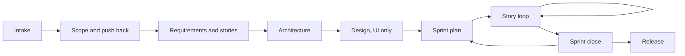

# whole-team

**One developer, every hat.** An agent skill that makes your AI coding agent work like a disciplined agile team: it scopes the brief and pushes back when the ask does not fit, writes the stories and the Definition of Done, keeps your board in sync, and delivers story by story with tests, docs, an independent review and your approval at every gate.

[](https://github.com/SuhaasNv/whole-team/actions/workflows/validate.yml)
[](LICENSE)

Works with Claude Code (as a plugin, with slash commands and a reviewer agent) and with any agent that reads [Agent Skills](https://agentskills.io): Codex, Cursor, GitHub Copilot, Gemini CLI and others.

## Why

AI agents write code fast. What they skip is everything around the code that a good team does without thinking:

- saying "that does not fit in three days, here is what I would build instead"
- refusing to add Kubernetes to a two-user app
- writing the test before calling a story done
- updating the docs in the same change as the code
- keeping the board honest
- asking before pushing

whole-team puts those habits into the agent, and scales the ceremony to the project: a weekend build gets five documents, an assessment or a client handover gets the full set.

## Install

**Claude Code (plugin, recommended).** Includes the skill, six slash commands and the reviewer agent:

```
/plugin marketplace add SuhaasNv/whole-team
/plugin install whole-team@whole-team
```

**Any agent (Claude Code, Codex, Cursor, Copilot, ...)** with the open [skills CLI](https://github.com/vercel-labs/skills). Installs the skill only:

```bash
npx skills add SuhaasNv/whole-team
```

**Manual.** Copy the skill folder into your agent's skills directory:

```bash
git clone https://github.com/SuhaasNv/whole-team.git
cp -r whole-team/skills/whole-team ~/.claude/skills/        # all projects
# or: cp -r whole-team/skills/whole-team .claude/skills/    # this project only
```

Needs `git` and Python 3.9 or newer (already on macOS and most Linux) for the helper script. The `gh` CLI is optional, for GitHub Projects.

## Quick start

In your project, talk to your agent:

| You say | What happens |
|---------|--------------|
| `/whole-team:start` or "set up whole-team on this project" | Reads the repo, asks one batch of questions (profile, board, sprint length, branching), creates the docs and config, connects your board |
| `/whole-team:scope` + paste a brief | Brief analysis, capacity math, the thinnest valuable slice, `SCOPE.md`, and a pushback message for anything that does not fit |
| `/whole-team:story` or "next story" | The full story loop, from branch to merge, ending in a one-line status |
| `/whole-team:status` | Sprint, work in progress, next story, blockers, anything you must decide |
| `/whole-team:close-sprint` | Tests, board, CHANGELOG (Shipped / Slipped / Retro), scope check |
| `/whole-team:release v0.2.0` | Release lint, notes, UAT, traceability, then asks before anything leaves your machine |

Without the plugin, say the same things in plain words ("use whole-team to scope this brief").

## How it works



### Six rules

1. **Scope before code.** Nothing is built that is not in `SCOPE.md` with a priority.
2. **Do not overengineer.** Every new service, layer, dependency or abstraction names the requirement that needs it. Simple, never sloppy.
3. **Push back with evidence.** Once, with the numbers, an alternative and the decision needed. Then follow the owner's call and record it.
4. **Every hat, every story.** Done means tests, docs, board and review, not "the code works".
5. **Gates are real.** You say yes before scope changes, designs, and every push, pull request, tag or deploy.
6. **Report the truth.** No story marked Done that fails its Definition of Done; no "tests pass" without a run.

### Ceremony profiles

| Profile | For | Documents |
|---------|-----|-----------|
| `lite` | Weekend builds, prototypes | Scope, changelog, architecture one-pager, stories, Definition of Done |
| `standard` | Products with users, portfolio work | + requirements, ADRs, sprints, threat model, test strategy, docs index, release notes |
| `strict` | Assessments, regulated work, handovers | + use cases, operations runbook, UAT plan, traceability matrix |

Flags: `--ui` (design document), `--brief` (brief analysis), `--assessment` (brief analysis, traceability, AI usage).

### The story loop

```
Pull → Board "In progress" + branch → Design approved (screens) → Plan → Tests first where they pay
→ Smallest change → Lint, typecheck, tests, build → Docs updated (hats pass) → Independent review
→ Definition of Done → --no-ff merge into dev → Board "Done" → "Done: … Next: … Decide: …"
```

Branching: `main` for releases, `dev` for integration, one `feat/us-<id>-<slug>` branch per story, plus `fix/`, `chore/`, `docs/`, `refactor/`, `test/`, `spike/`, `release/` and `hotfix/` with rules for each. Trunk-based is available for lite projects.

## Boards: Notion, Jira, Linear, GitHub Projects or none

At intake the agent asks where your stories and use cases should live and recommends one. `docs/05-planning/USER_STORIES.md` is always the portable record; the board mirrors it one to one and is updated in the same turn as the work.

| Board | Connect |
|-------|---------|
| GitHub Projects | `gh auth refresh -s project` (uses the `gh` CLI) |
| Linear | `claude mcp add --transport http linear-server https://mcp.linear.app/mcp` |
| Jira | `claude mcp add --transport http atlassian https://mcp.atlassian.com/v2/mcp` |
| Notion | `claude mcp add --transport http notion https://mcp.notion.com/mcp` |
| Local | Nothing: `wt.py kanban` writes `KANBAN.md` from your stories |

Then run `/mcp` to sign in. Other agents: add the same URL to their MCP settings. The agent never handles your tokens.

## Scoping and pushback, in practice

Given a three-day brief with five features, the agent sizes them (24 hours) against the time you have (15 hours after a 30% reserve for tests, docs and deployment) and comes back with:

```
Recommendation: build patient booking and doctor availability as one tested, deployed loop,
plus reminders behind a provider interface with a mock sender. Defer the walk-in queue and
reports with a written design for each.
Why: 24 h of MUST work against 15 h available. Booking and availability hold the hardest graded parts.
What we give up: receptionists and admins get accounts, not features. Adding them later is additive.
Alternative: all five at demo quality: no end-to-end tests, no deployment, thin docs.
Decision needed: A) the slice (recommended)  B) all five, reduced quality
```

Full example: [examples/assessment-walkthrough.md](examples/assessment-walkthrough.md).

## What lands in your repo (standard profile)

```
.whole-team.json                     profile, board, branches, sprint, WIP limit, freeze
SCOPE.md                             decision, MoSCoW, assumptions, cut order, decision log
CHANGELOG.md  RELEASE_NOTES.md
docs/
  README.md                          index, kept truthful
  02-requirements/REQUIREMENTS.md
  03-architecture/ARCHITECTURE.md    + decisions/ (ADRs)
  05-planning/USER_STORIES.md        + DEFINITION_OF_DONE.md, SPRINTS.md
  06-security/THREAT_MODEL.md
  07-testing/TEST_STRATEGY.md
CLAUDE.md or AGENTS.md               + a working agreement block, so the rules hold in every session
```

## Helper script

`skills/whole-team/scripts/wt.py`, Python standard library only:

```bash
wt.py init --profile standard --board github [--ui] [--brief] [--assessment] [--trunk]
wt.py status          # counts, WIP, next story by dependency, blockers, handover note
wt.py lint            # story format, dependencies, requirement coverage, missing docs
wt.py lint --release  # every MUST done, nothing in progress, no placeholders left
wt.py kanban          # KANBAN.md from USER_STORIES.md
wt.py agreement       # the working agreement block for CLAUDE.md / AGENTS.md
```

## FAQ

**Will this slow me down?** Pick `lite` and it adds a scope file, a story list and a Definition of Done. The questions it asks up front are the ones that save a rewrite later.

**Does it push to GitHub for me?** Never without your yes in that turn. Every push, pull request, tag, deploy and outward message asks first.

**I already have a codebase.** Say so. It surveys read-only, writes the architecture doc from the code, sets a Definition of Done your codebase can meet today, and lists the gap as "DoD debt". It does not refactor anything during adoption.

**Will it refuse what I ask?** No. It pushes back once with evidence and an alternative. If you still want it, it records your decision and builds it well.

## Where it comes from

The method was used on [PermitFlow](https://github.com/SuhaasNv/permitflow), a licensing platform built solo with an AI agent in one-day sprints: a scope decision that deferred a whole use case with a written design, stories mirrored to a Notion board, a Definition of Done that gated every merge into `dev`, design approval before screen code, a sprint close ritual each day, and a frozen `main` while the release was under review. whole-team is that process with the project-specific parts removed.

Inspired by the skills ecosystem around [anthropics/skills](https://github.com/anthropics/skills) and [obra/superpowers](https://github.com/obra/superpowers). whole-team focuses on the product and delivery layer (scope, stories, board, sprints, releases) and works alongside task-level skills like those.

## Contributing

Issues and pull requests are welcome. See [CONTRIBUTING.md](CONTRIBUTING.md). Behaviour changes come with an eval case in [evals/evals.json](evals/evals.json).

## License

[MIT](LICENSE) © Suhaas Nv
