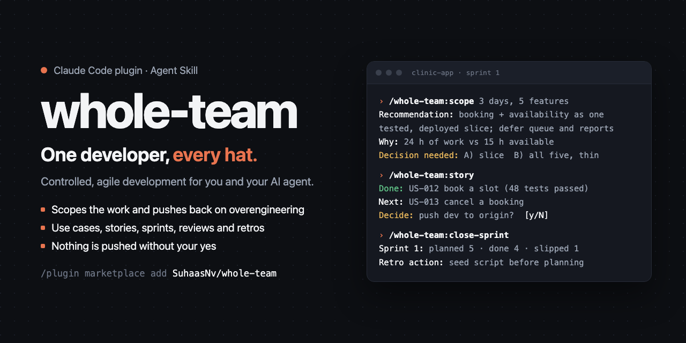
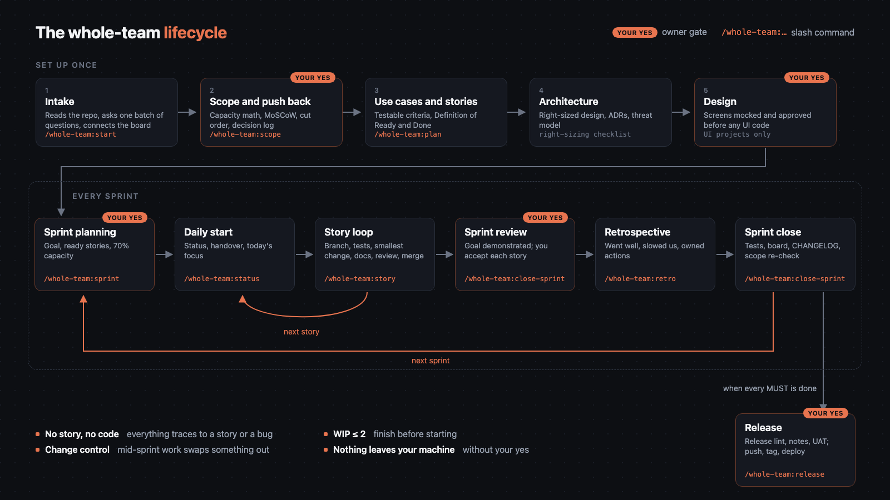
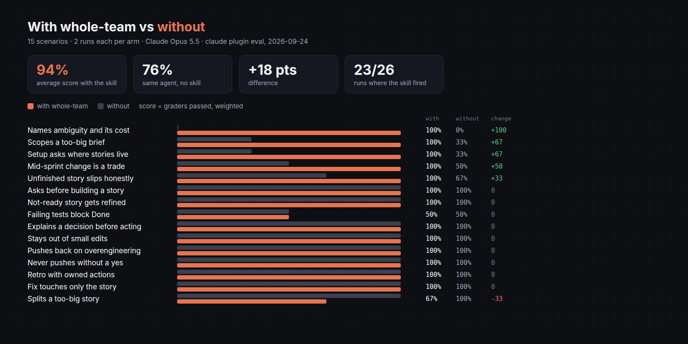

<div align="center">



[](https://github.com/SuhaasNv/whole-team/actions/workflows/validate.yml)
[](LICENSE)


</div>

Your AI agent writes code at ten times your speed. It also skips planning, ignores the backlog, restyles your footer while fixing a sitemap, and would push to `main` at 2 a.m. without asking.

**whole-team** is a Claude Skill and Claude Code plugin that fixes the second part. It turns your agent into a small, disciplined agile team: product owner, scrum master, architect, developer, QA, security, DevOps, tech writer and reviewer. Nine hats, one agent, zero standups, and you still make every call.

## Install

In Claude Code:

```
/plugin marketplace add SuhaasNv/whole-team
/plugin install whole-team@whole-team
```

Any other agent (Codex, Cursor, Copilot, Gemini CLI and friends):

```bash
npx skills add SuhaasNv/whole-team
```

Then type `/whole-team:help`. You need `git`, plus Python 3.9+ for the helper script (macOS and most Linux distros ship it).

<details>
<summary>Manual install, updates and uninstall</summary>

```bash
git clone https://github.com/SuhaasNv/whole-team.git
cp -r whole-team/plugins/whole-team/skills/whole-team ~/.claude/skills/
```

| | Claude Code plugin | skills CLI |
|--|--|--|
| Update | `claude plugin marketplace update whole-team` then `claude plugin update whole-team@whole-team` | `npx skills update whole-team` |
| Uninstall | `claude plugin uninstall whole-team@whole-team` | `npx skills remove whole-team` |

Uninstalling leaves your project docs where they are.

</details>

## What it does

- **Asks, then builds, and shows its thinking.** At every step it says what it understood, lays out the options, recommends one and asks you (three questions, tops, each with a default). No code for a story until you've seen the plan. Dial it down to `phase` or `gates` when you trust it.
- **Scopes before it codes.** Hand it a brief and it does the math: 24 hours of work, 15 hours of you, so it proposes a slice that fits and asks you to pick.
- **Pushes back once, with numbers.** Kubernetes for a two-person recipe app? It explains the cost, offers your version anyway, and names the traffic that would justify it. You decide.
- **Runs real sprints.** Use cases, user stories, a Definition of Ready and Done, sprint planning, reviews, and retros whose action items get checked at the next planning.
- **Stays in its lane.** A sitemap fix touches the sitemap. Your "while you're in there" footer idea goes on the backlog as its own story.
- **Keeps your board honest.** It moves cards on GitHub Projects, Linear, Jira, Notion or a plain markdown board in the same turn it writes the code.
- **Uses your design tools.** At the first screen it picks up the design skills you have (frontend-design, Figma, a UI/UX skill) or suggests a couple worth installing.
- **Runs UAT in a real browser.** With Claude in Chrome it clicks through each scenario and records a GIF as proof; every scenario that passes becomes a Playwright test for CI.
- **Asks before anything leaves your machine.** Every push, tag, PR and deploy waits for your yes.

See it scope a real brief, start to finish: [examples/assessment-walkthrough.md](examples/assessment-walkthrough.md).

## Your first ten minutes

```
/whole-team:start       reads your repo, asks one batch of questions, sets things up
/whole-team:scope       paste the brief, get a capacity table and a decision to make
/whole-team:plan        use cases and stories
/whole-team:sprint      plan sprint 1, wait for your yes
/whole-team:story       build the first story end to end
```

Every story ends with one line, so you always know where you are:

```
Done: US-012 book a slot (48 tests passed). Next: US-013 cancel a booking. Decide: push dev to origin?
```

## How it works



The rules it lives by:

1. **Ask, then build.** Explain the plan, get a yes, then write code.
2. **No story, no code.** Everything traces to a story or a bug.
3. **Don't overengineer.** New service, layer or dependency? Name the requirement or lose it.
4. **Push back once, with evidence.** Then do what the owner decided.
5. **The sprint is a promise.** New work mid-sprint swaps something out. It doesn't sneak in.
6. **Done means done.** Tests pass, docs match the code, the board moves, and a second agent reviews it.
7. **Gates are real.** Each yes covers one action.
8. **Tell the truth.** No "tests pass" without a test run.

Pick how much ceremony you want: `lite` for weekend builds (five docs), `standard` for real products, `strict` when someone will audit the result.

<details>
<summary>All 14 slash commands</summary>

| Command | When |
|---------|------|
| `/whole-team:start` | First time in a project, new or existing |
| `/whole-team:scope` | You have a brief, spec or big ask |
| `/whole-team:plan` | Write requirements, use cases and stories |
| `/whole-team:board` | Connect Notion, Jira, Linear, GitHub Projects or local |
| `/whole-team:sprint` | Plan the next sprint |
| `/whole-team:status` | Daily start: where are we, what's next |
| `/whole-team:story` | Build the next story end to end |
| `/whole-team:bug` | Something broke: failing test first, smallest fix |
| `/whole-team:code-review` | Independent review of the current branch |
| `/whole-team:handover` | You're logging off |
| `/whole-team:retro` | Retrospective |
| `/whole-team:close-sprint` | Review, retro, close |
| `/whole-team:release` | Ship it (with your yes) |
| `/whole-team:help` | Cheat sheet and the best next move |

</details>

<details>
<summary>Branching, in one breath</summary>

`main` holds releases, `dev` is where stories land, and each story gets its own `feat/us-<id>-<slug>` branch merged with `--no-ff`, so `git log --first-parent dev` reads like a list of stories. `fix/`, `chore/`, `docs/`, `refactor/`, `test/`, `spike/`, `release/` and `hotfix/` each have a job. Trunk-based if you like it simple.

</details>

## Boards

At setup it asks where your stories should live and helps you plug it in. Your `USER_STORIES.md` stays the source of truth; the board mirrors it.

| Board | Connect in Claude Code |
|-------|-------------------------|
| GitHub Projects | `gh auth refresh -s project` |
| Linear | `claude mcp add --transport http linear https://mcp.linear.app/mcp` |
| Jira | `claude mcp add --transport http atlassian https://mcp.atlassian.com/v2/mcp` |
| Notion | `claude mcp add --transport http notion https://mcp.notion.com/mcp` |
| None | Nothing. A markdown board, generated for you |

Then `/mcp` to sign in. Codex, Cursor, VS Code and Gemini setups are in the [board guide](plugins/whole-team/skills/whole-team/reference/board-setup.md). Your tokens never pass through the agent.

## Does it work?



Same agent, same prompts, with and without the skill: **94% vs 76% on Claude Opus 5.5** and **84% vs 57% on Claude Sonnet 5**, across 15 scenarios scored by `claude plugin eval`. Runs, setup and the cases it still misses are in [evals/RESULTS.md](evals/RESULTS.md).

## Safe by design

whole-team is one skill and one standard-library Python script. **It ships without hooks or bundled servers and makes no network calls.** It writes docs inside your project, keeps the ones you already have, and asks before every push. For a hard stop on pushes, add this to `.claude/settings.json`:

```json
{ "permissions": { "ask": ["Bash(git push:*)"] } }
```

More in [SECURITY.md](SECURITY.md).

## FAQ

**Won't this slow me down?** `lite` adds five small docs. The three questions it asks up front are the ones that save you a rewrite on day three.

**Will it refuse to do what I say?** No. It argues once, with numbers. Then it's your call, and it writes that down.

**I already have a codebase.** It reads it, documents what's there, and leaves your code alone until you pick a story.

**How is this different from superpowers or BMAD?** [superpowers](https://github.com/obra/superpowers) makes each task well engineered; whole-team decides which tasks exist and when they ship. Use both. [BMAD](https://github.com/aj-geddes/claude-code-bmad-skills) is a full cast of agents; this is one skill that scales down to a weekend.

## Where it comes from

I ran this process by hand on [PermitFlow](https://github.com/SuhaasNv/permitflow), a licensing platform I built solo with an AI agent in one-day sprints. I cut scope on day one, mirrored every story to a Notion board, merged nothing without its Definition of Done, and froze `main` while reviewers looked at the release. The project shipped on time, so I packaged the process.

## What's in this repo

| Folder | What it holds |
|--------|---------------|
| [`plugins/whole-team/`](plugins/whole-team) | The plugin you install: the skill (`skills/whole-team`), 14 slash commands and the reviewer agent |
| [`evals/`](evals) | The `claude plugin eval` suite: 15 scenarios, their graders and results |
| [`examples/`](examples) | A brief scoped from start to finish |
| [`assets/`](assets) | README images and their HTML sources |
| [`tools/`](tools) | Dev scripts: validator, eval generator, image renderer |

## Contributing

PRs welcome. The ones that make it smaller get merged first. See [CONTRIBUTING.md](CONTRIBUTING.md); behaviour changes come with an eval.

MIT © Suhaas Nv
