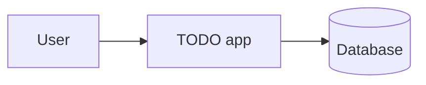
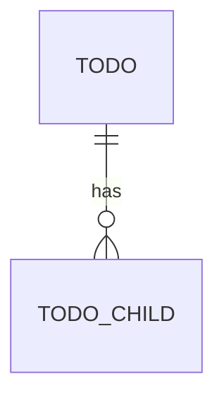

# Architecture

Describes what exists. Updated in the same change as the code.

## Stack

TODO(whole-team): three to five sentences.

## Context

## Modules

| Module | Owns |
|--------|------|
| TODO(whole-team) | |

## Critical journey

TODO(whole-team): numbered steps or a Mermaid sequenceDiagram.

## API

| Method | Path | Roles | Purpose |
|--------|------|-------|---------|

## Data model

## Errors

Every error response: `{ "error": { "code": "...", "message": "...", "details": {} } }`.

## Configuration

| Variable | Required | Purpose |
|----------|----------|---------|

Mirrored in `.env.example`.
